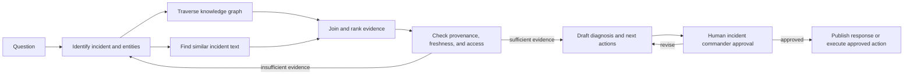

# Graph engineering in AI and LLM systems

Research note, 7 August 2026. Sources are standards, official project documentation, and original research papers.

## Short answer

**Graph engineering is the deliberate design, construction, validation, and operation of graph-shaped structures used by an AI system.** A graph represents things as **nodes** and connections as **edges**. In LLM work, however, the phrase is ambiguous: the graph might describe what the system knows, how it retrieves evidence, how an agentic application executes, or how a machine-learning model computes.

The most useful mental model is therefore:

> Graph engineering is not one new model or algorithm. It is an engineering approach that makes important relationships and allowed paths explicit rather than leaving them buried in text, prompts, or ad-hoc code.

There are four distinct meanings that are often mixed together:

| Meaning | Nodes represent | Edges represent | Main purpose |
|---|---|---|---|
| Knowledge/data graph | entities, concepts, events, documents, claims | typed real-world relationships | structure what the system knows |
| Graph-based retrieval / GraphRAG | entities, passages, claims, communities | semantic or source links used during search | select evidence for an LLM |
| Application/workflow graph | functions, agents, tools, decisions, human gates | allowed transitions or dependencies | control what the system does |
| Graph neural network (GNN) | data items with learned features | relations over which features are aggregated | learn predictions from graph-structured data |

The first meaning has an established discipline called **knowledge graph engineering**. The newer agentic-AI usage often means the third: engineering a task or multi-agent topology. This particular label surged in July 2026; LangChain's own account describes it as a new buzzword for the established practice of representing agentic systems as graphs ([LangChain, “3 Years of Graph Engineering with LangGraph”](https://www.langchain.com/blog/3-years-of-graph-engineering-with-langgraph)). Framework documentation generally uses terms such as *Graph API* and *GraphFlow*, while a July 2026 preprint proposes a more formal definition because “graph” is still used for several different structures ([LangGraph Graph API](https://docs.langchain.com/oss/python/langgraph/graph-api), [Microsoft AutoGen GraphFlow](https://microsoft.github.io/autogen/dev/user-guide/agentchat-user-guide/graph-flow.html), [Macedo 2026 preprint](https://arxiv.org/abs/2607.27578)). The safest interpretation is therefore not “a brand-new AI discipline,” but “explicit graph-based design”—followed immediately by the question: **which graph?**

## 1. Knowledge graphs: engineering what the system knows

A knowledge graph makes facts and their relationships explicit. In the W3C RDF model, data is a set of subject-predicate-object triples, and the resulting structure is a directed, labelled graph ([W3C RDF overview](https://www.w3.org/2001/sw/wiki/RDF)). For example:

```text
PaymentService --DEPENDS_ON--> OracleDatabase
Change-1842    --DEPLOYED_TO--> PaymentService
Incident-731   --AFFECTS-----> PaymentService
Runbook-44     --APPLIES_TO--> OracleDatabase
```

This is not merely a visualization. The edge types carry machine-queryable meaning. An ontology can formalize the domain vocabulary and relationships; W3C describes ontologies as shared, formalized vocabularies whose terms are defined through their relationships to other terms ([OWL 2 overview](https://www.w3.org/TR/owl-overview/)). A graph can then be queried by relationship patterns—for RDF graphs, SPARQL is the standardized query language ([SPARQL 1.1](https://www.w3.org/TR/sparql11-query/)).

The actual engineering work is a lifecycle:

1. **Scope the questions.** Decide which decisions or queries the graph must support. A graph of everything is usually an expensive graph of nothing useful.
2. **Design the semantic model.** Define stable identifiers, node and relationship types, cardinalities, allowed values, time semantics, and ownership.
3. **Ingest and transform sources.** Map databases, events, APIs, and documents into the model. LLMs may extract candidate entities, relationships, and claims from text, but those outputs are data to validate—not automatically trusted facts. Microsoft GraphRAG's standard indexer explicitly extracts entities, relationships, and claims from raw text ([GraphRAG indexing overview](https://microsoft.github.io/graphrag/index/overview/)).
4. **Resolve identity.** Merge different mentions of the same real object and keep different objects apart. Neo4j's official knowledge-graph builder, for example, has an entity-resolution stage specifically for merging nodes that represent the same real-world object ([Neo4j knowledge graph builder](https://neo4j.com/docs/neo4j-graphrag-python/current/user_guide_kg_builder.html#entity-resolver)). This is often harder and more consequential than generating triples.
5. **Record provenance and time.** Store where a claim came from, when it was valid, how it was produced, and its confidence or review state. The W3C PROV-O standard provides classes and relationships for interoperable provenance descriptions ([PROV-O](https://www.w3.org/TR/prov-o/)).
6. **Validate quality.** Enforce structural and business constraints. For RDF, SHACL validates a data graph against a shapes graph and produces a validation report ([W3C SHACL](https://www.w3.org/TR/shacl/)).
7. **Store, index, and serve.** Choose a graph database, RDF store, relational representation, or files based on query and operating needs; add indexes, access control, versioning, and APIs.
8. **Evaluate and maintain.** Measure extraction accuracy, entity-resolution quality, relation completeness, query usefulness, freshness, latency, cost, and drift as source systems and the ontology change.

An important point: **a graph-shaped knowledge model does not require a graph database**. Microsoft's GraphRAG implementation stores its conceptual graph outputs as Parquet tables by default and sends embeddings to a configured vector store ([GraphRAG outputs](https://microsoft.github.io/graphrag/index/outputs/), [indexing overview](https://microsoft.github.io/graphrag/index/overview/)). Storage technology and information model are separate decisions.

## 2. GraphRAG: engineering how the LLM finds evidence

Classic retrieval-augmented generation (RAG) combines a language model's parametric memory with an external searchable memory. The original RAG paper used a dense vector index of Wikipedia and a neural retriever ([Lewis et al., NeurIPS 2020](https://papers.neurips.cc/paper_files/paper/2020/hash/6b493230205f780e1bc26945df7481e5-Abstract.html)). In a common modern implementation, documents are split into chunks, embedded, and retrieved by semantic similarity.

That works well when the relevant answer is concentrated in a few text passages. It is weaker when the question depends on:

- a multi-hop path across entities;
- an exact relationship or dependency;
- evidence distributed across many documents;
- a global question about themes or structure in the full corpus.

**GraphRAG adds graph structure to indexing and/or retrieval.** Microsoft's original GraphRAG method uses an LLM to derive an entity knowledge graph, detects communities of related entities, and pre-generates community summaries. At query time, those summaries support corpus-level, query-focused summarization ([Microsoft Research paper](https://www.microsoft.com/en-us/research/publication/from-local-to-global-a-graph-rag-approach-to-query-focused-summarization/)). Its current implementation distinguishes:

- **local search**, which starts from semantically related entities and retrieves connected entities, relationships, community reports, and associated source chunks;
- **global search**, which searches AI-generated community reports using a map-reduce process;
- **DRIFT search**, which combines community-level context with iterative local exploration;
- **basic search**, a vector-RAG baseline.

These are described in the official [GraphRAG query overview](https://microsoft.github.io/graphrag/query/overview/) and [local-search dataflow](https://microsoft.github.io/graphrag/query/local_search/).

GraphRAG should therefore be understood as a **retrieval architecture**, not as “letting an LLM reason magically over a graph.” The graph is used to locate and organize evidence; selected evidence is still serialized into the model's finite context window. Microsoft's local search explicitly ranks and filters candidate graph and text data to fit a predefined context size ([local-search methodology](https://microsoft.github.io/graphrag/query/local_search/)).

It also introduces costs and failure modes:

- LLM-based indexing can be expensive. Microsoft estimates that graph extraction accounts for roughly 75% of the standard method's indexing cost; its faster alternative is cheaper but produces a noisier and less reusable graph ([GraphRAG indexing methods](https://microsoft.github.io/graphrag/index/methods/)).
- Incorrect extraction or entity merging creates plausible but false paths.
- A graph schema can omit relationships that users later need.
- Highly connected nodes can flood retrieval with generic context.
- Community summaries are generated artifacts and can lose detail.
- Re-indexing, graph updates, deletion, provenance, permissions, and evaluation become production concerns.

A sensible default is often **hybrid retrieval**: use vector similarity to find entry points, graph traversal to expand through relevant typed relationships, keyword or exact filters for identifiers, and a reranker or deterministic budget to select the final evidence. Use full GraphRAG only when graph-aware queries demonstrably beat a simpler baseline on representative questions.

## 3. Workflow graphs: engineering what the LLM application does

Here the graph is a control-flow structure, not a knowledge base.

In LangGraph, **state** is the application's current data, **nodes** are functions that perform work, and **edges** determine which node executes next. Nodes can contain an LLM call or ordinary code; edges can be fixed or conditional ([LangGraph Graph API](https://docs.langchain.com/oss/python/langgraph/graph-api)). Microsoft AutoGen's GraphFlow similarly uses a directed graph in which agent nodes support sequential, parallel, conditional, and looping execution, with edges defining allowed paths ([AutoGen GraphFlow](https://microsoft.github.io/autogen/dev/user-guide/agentchat-user-guide/graph-flow.html)).

This makes the application's topology explicit:

```text
classify request
      |
      +-- factual question --> retrieve evidence --> verify citations --+
      |                                                               |
      +-- proposed action ---> risk check -------> human approval -----+--> respond/execute
```

Engineering this graph means deciding:

- which responsibilities deserve separate nodes;
- which nodes use an LLM and which should be deterministic code;
- what shared state each node may read or write;
- what information crosses each edge;
- where parallel fan-out and joins are safe;
- which conditions create loops and the hard stop rule for each loop;
- where human approval is mandatory;
- how runs are checkpointed, retried, cancelled, audited, and evaluated;
- how permissions and budgets are constrained per node.

This is why workflow graphs matter for agentic systems: a free-running “model calls tools until done” loop hides control decisions inside model behavior. A graph can expose those decisions as versioned application structure. It does not guarantee correctness, but it gives engineers places to impose invariants, observability, deterministic gates, and bounded failure handling. LangGraph's official overview emphasizes durable execution, human-in-the-loop control, state persistence, and tracing as core runtime concerns ([LangGraph overview](https://docs.langchain.com/oss/python/langgraph/overview)).

Not every workflow needs a graph framework. A fixed sequence of three calls is usually clearer as ordinary code. Graph orchestration earns its complexity when there are meaningful branches, cycles, parallel work, resumable state, multiple agents, or approval gates.

## 4. Graph neural networks: related, but a different layer

A graph neural network is a trainable model for graph-structured data. A common GNN operation updates a node representation by aggregating messages from neighbouring nodes and edge features ([PyTorch Geometric message-passing documentation](https://pytorch-geometric.readthedocs.io/en/latest/tutorial/create_gnn.html)). GNNs are useful for tasks such as node classification, link prediction, recommendation, molecular prediction, and anomaly detection; Google Research describes them as methods that use both graph connectivity and node/edge features ([Google Research overview](https://research.google/blog/graph-neural-networks-in-tensorflow/)).

A GNN can be part of a graph-engineered LLM system—for example, to rank likely relevant nodes or detect anomalous transaction clusters—but it is **not required** for a knowledge graph, GraphRAG, or a workflow graph. The distinction is:

- knowledge/workflow graphs are engineered **data or control structures**;
- a GNN is a learned **predictive model operating on graph data**.

LLMs also do not automatically reason reliably over graph structures serialized as text. In Google's GraphQA experiments, performance depended strongly on graph encoding and graph shape, and models struggled on many basic graph tasks ([Google Research, “Talk like a graph”](https://research.google/blog/talk-like-a-graph-encoding-graphs-for-large-language-models/)). For exact reachability, permissions, dependency closure, or shortest paths, execute a graph query or graph algorithm and give the verified result to the LLM rather than asking the LLM to simulate the algorithm in prose.

## 5. Practical example: an IT incident copilot

Suppose a bank wants an assistant that answers: **“What probably caused the card-payment outage, what is affected, and what should we do next?”**

### Knowledge graph

Nodes include `Service`, `Database`, `Host`, `Deployment`, `Incident`, `Alert`, `Team`, `Runbook`, and `Evidence`. Typed edges include `DEPENDS_ON`, `DEPLOYED_TO`, `PRECEDED`, `AFFECTS`, `OWNED_BY`, `APPLIES_TO`, and `SUPPORTED_BY`.

Each extracted claim links back to the source log line, monitoring event, change ticket, or runbook version. Time validity matters: a dependency or owner valid last month may not be valid now. Entity resolution maps aliases such as `payments-prod`, `PAY-SVC`, and a CMDB identifier to the correct service without merging a similarly named test service.

### Retrieval graph

The question is embedded to find entry entities such as the current outage and card-payment service. The retriever then follows bounded, typed paths:

```text
Incident --AFFECTS--> Service --DEPENDS_ON--> Database
   |                      |
   |                      +--OWNED_BY--> Team
   +--PRECEDED_BY--> Deployment --SUPPORTED_BY--> ChangeTicket
Database --APPLIES_TO--> Runbook
```

It returns both the structured path and the original evidence snippets. A vector search can add semantically similar past incidents. A deterministic step removes evidence the caller is not authorized to see and caps traversal depth and context size.

### Workflow graph

The application then executes:



The LLM is useful for entity extraction, semantic query interpretation, synthesis, and drafting. Deterministic components should own access control, time filtering, graph traversal, evidence thresholds, stop limits, and action authorization. A GNN is optional; it might later rank likely failure-propagation paths if enough labelled incidents exist, but it is not needed for the first useful version.

### What to evaluate

Evaluate the layers separately so a fluent answer cannot hide a bad graph:

- **graph data:** entity precision/recall, relationship accuracy, duplicate and false-merge rates, provenance coverage, freshness;
- **retrieval:** evidence recall, path relevance, authorization correctness, context size, latency, cost;
- **generation:** claim support, citation accuracy, completeness, abstention when evidence is weak;
- **workflow:** branch correctness, loop termination, recovery after failure, human-gate enforcement, audit completeness;
- **business outcome:** time to identify cause, unsafe recommendation rate, and operator acceptance.

## 6. When graph engineering is worth it

It is a strong fit when the domain is relationship-heavy, identity matters, multi-hop questions are common, provenance is important, or the workflow has branching and control requirements. Examples include service dependencies, fraud rings, supply chains, access rights, scientific literature, customer-account relationships, regulatory obligations, and multi-agent processes.

It is probably unnecessary when a small, stable document collection answers questions through direct passage retrieval; the task is a simple sequential pipeline; relationships do not affect the answer; or the organization cannot yet maintain identifiers, source quality, and ownership. In those cases, better metadata, hybrid search, or ordinary code may solve the problem more cheaply.

## Bottom line

When someone says **“graph engineering for AI,” ask which graph they mean**:

1. the knowledge graph that stores entities and relationships;
2. the retrieval graph that selects evidence for the model;
3. the workflow graph that controls agents and tools; or
4. a GNN that learns from graph-structured data.

A mature system may use the first three together and never use a GNN. The core engineering value is the same in each case: make relationships, paths, constraints, provenance, and control boundaries explicit; then test them independently of the LLM's eloquence.
